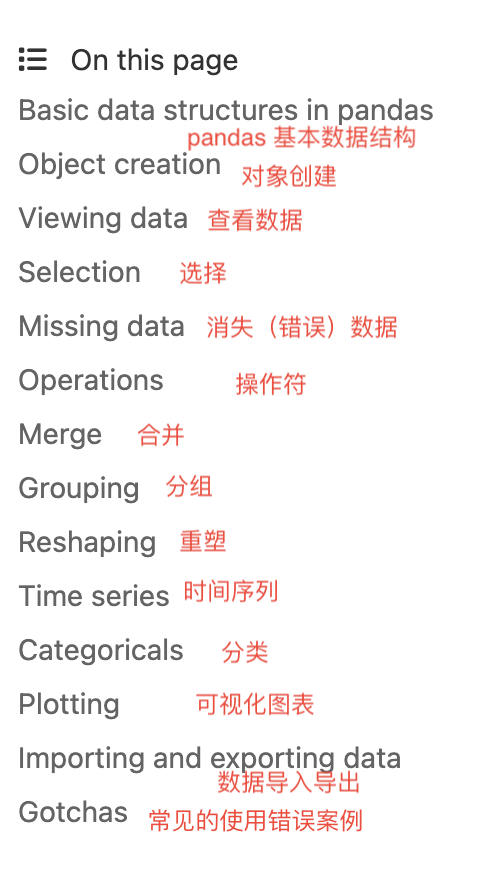

# learnpython
python入门学习

## 安装Pythong 和 pandas
- 下载并安装 Python（为兼容性考虑，下载老一点的版本，例如3.10）  
  在 Python 官网下载页面 (https://www.python.org/downloads/windows/) 上下载适用于 Windows 的 Python 安装包 （ Windows installer (64-bit) ），然后双击运行安装程序。在安装期间，请确保选中 "Add Python to PATH" 选项。
- 安装 pandas  
  打开命令行，输入以下命令：
  `pip install pandas`  
- 验证 python 和 pandas 是否正确安装  
  在命令行中输入以下命令：
  `import pandas as pd  
  pd.__version__`  
如果成功输出 pandas 版本号，则说明python 和 pandas 已经正确安装。

## Python
- 官网： https://www.python.org/
- 关于python：
  由荷兰人Guido van Rossum于1989年发明
  python是开源语言，遵循GPL(GNU General Public License)协议
  python是一种解释型语言 
  python使用4个空格作为逻辑块的区分
    
- 学习网站： https://www.learnpython.org/en/
  在这个学习网站上，依次点击Learn the Basics下面的所有知识点学习基础知识。 然后学习Data Science Tutorials下面的进阶知识。
  

  
  
- 学习过程中遇到问题的自助解答：
  1. AI: 打开baidu官网， https://www.baidu.com ， 点击右上角的AI, 向AI提出问题
     
  3. 问答网站：
     https://stackoverflow.com/
  4. 搜索引擎
     百度   
     必应： https://www.bing.com/?mkt=zh-CN

## Pandas
版本：
pandas目前最新版本2.1.1，支持的python版本是 Python 3.9, 3.10 和 3.11.
可以在如下的pandas官网上找到对应的版本关系：
https://pandas.pydata.org/docs/getting_started/install.html

pandas支持的数据格式：
- CSV and text files
- Microsoft Excel
-  SQL databases
-  fast HDF5 format   
官网参考链接：   
https://pandas.pydata.org/about/index.html

学习pandas：
参考官网的十分钟入门文档：

https://pandas.pydata.org/docs/user_guide/10min.html
